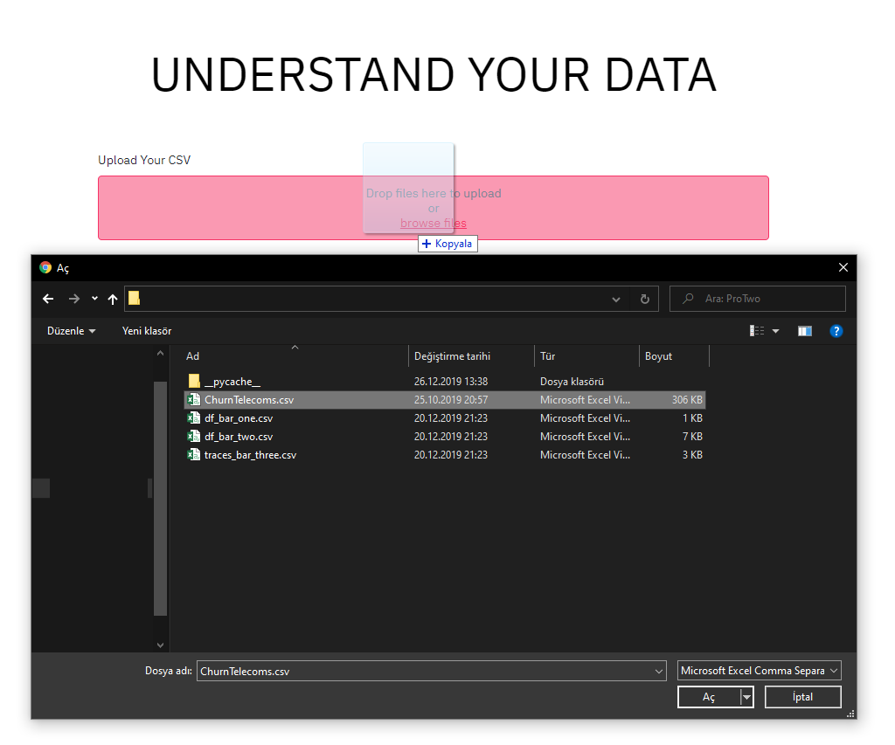
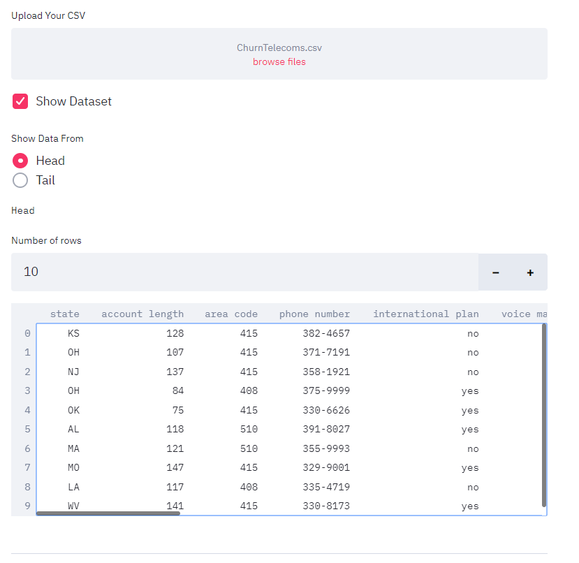
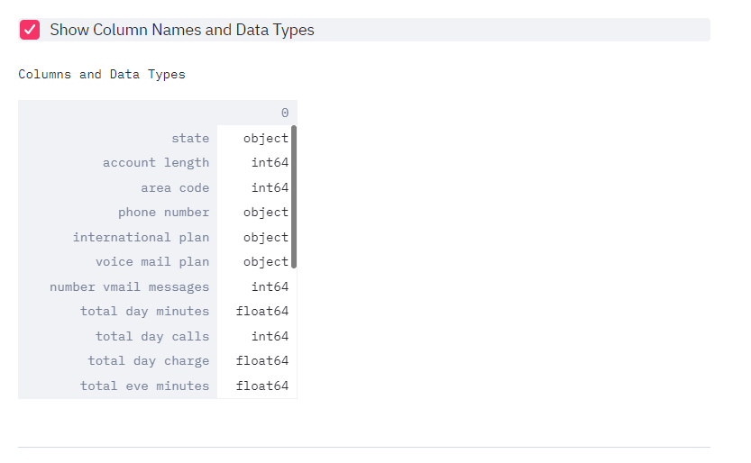
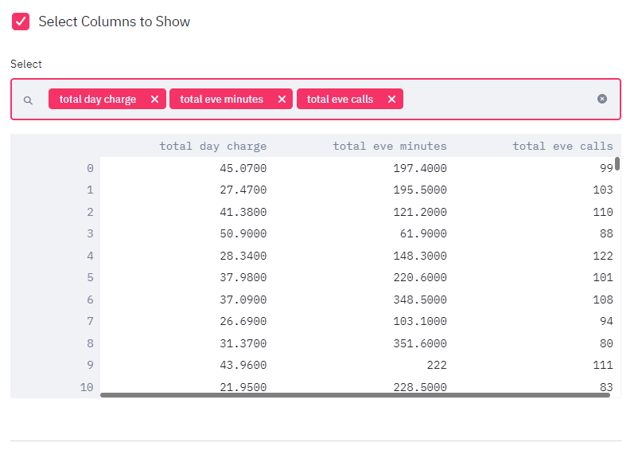
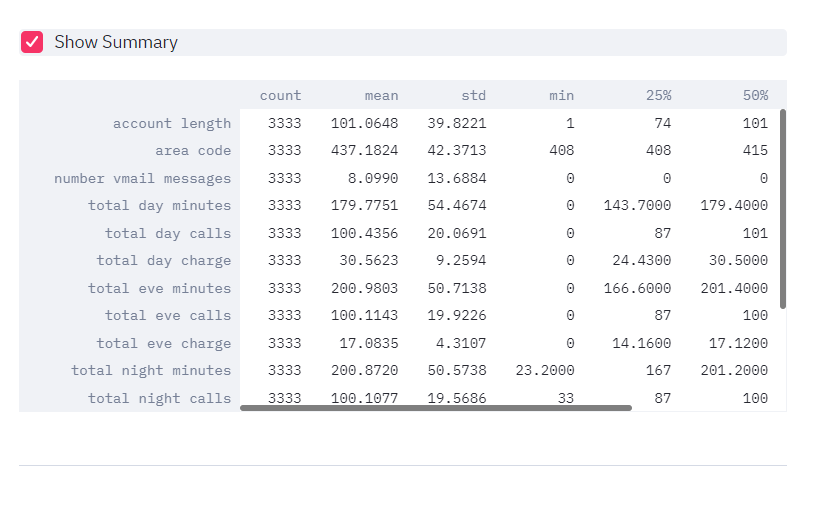
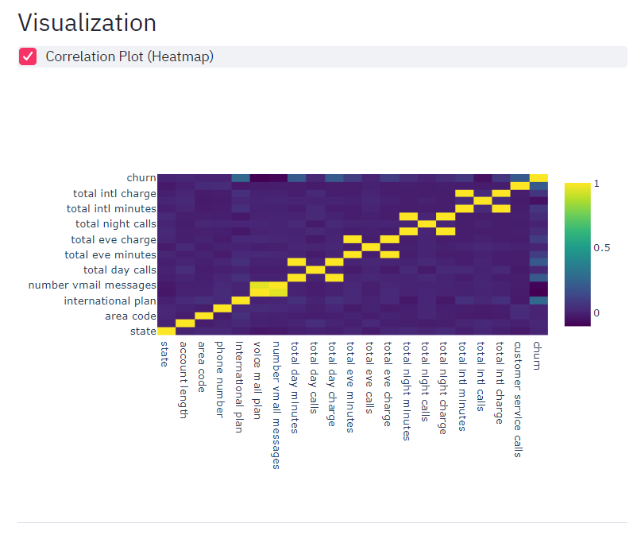
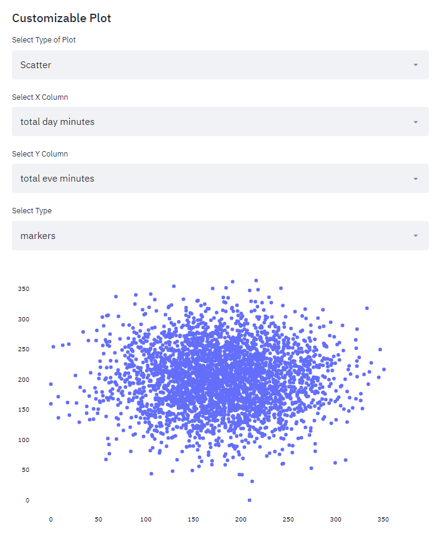

```ruby
$ streamlit run app.py
```
#### Screenshot


#### Screenshot


#### Screenshot


#### Screenshot


#### Screenshot


#### Screenshot


#### Screenshot


#### Screenshot


#### Screenshot

