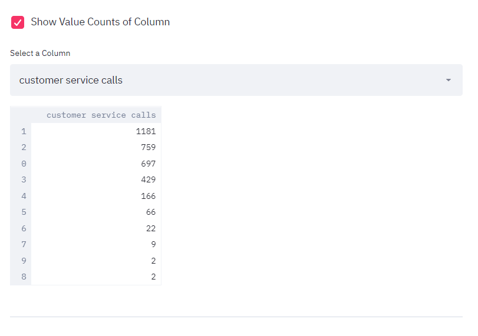
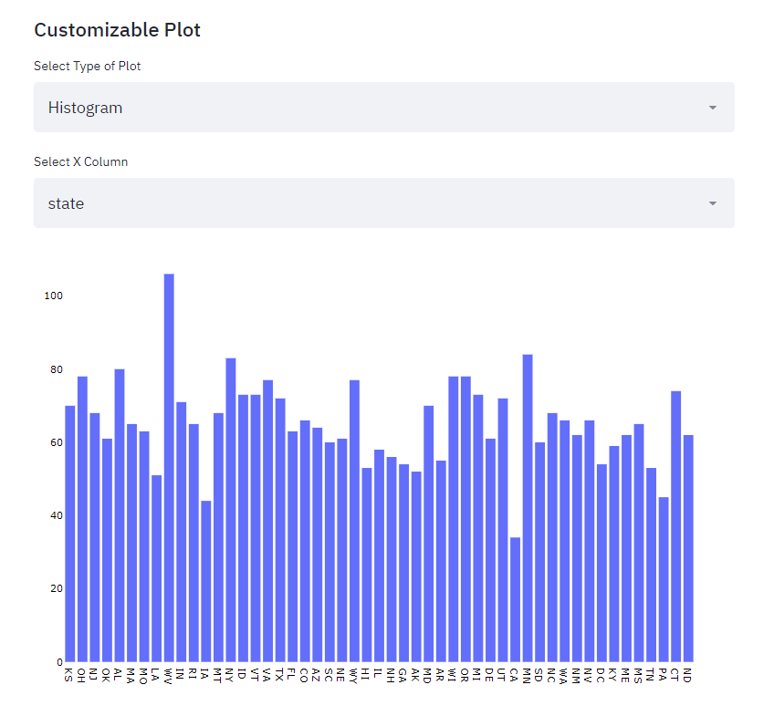

In terminal:
```ruby
$ streamlit run app.py
```
#### Upload your CSV File


#### Show your dataset


#### Show Column Names and Data Types


#### Select Columns to Show


#### Show Value Counts of Column


#### Show Summary


#### Heatmap


#### Customizable Plot


#### Customizable Plot

